# NovelReaderWeb Feature Task Lists

This directory contains individual task list JSON files for implementing features from the NovelReaderWeb project into Dramebaz (Storyteller).

## Task Lists Summary

### From Documentation Analysis
| File                         | Category             | Tasks | Hours | Priority Features                                      |
| ---------------------------- | -------------------- | ----- | ----- | ------------------------------------------------------ |
| `UITaskList.json`            | UI/UX Enhancements   | 6     | 31h   | Karaoke Highlighting, Waveform Visualizer              |
| `AudioPipelineTaskList.json` | Audio Pipeline       | 2     | 12h   | Director Pipeline, TTS Emotion Modifiers               |
| `InsightsTaskList.json`      | Insights & Analysis  | 5     | 18h   | Emotional Arc, Foreshadowing, Sentiment, Reading Level |
| `ThemeTaskList.json`         | Generative UI Themes | 1     | 6h    | LLM-based Theme Generation                             |
| `ArchitectureTaskList.json`  | Architecture         | 2     | 13h   | LLM Strategy Pattern, Play Asset Delivery              |
| `SummaryTaskList.json`       | Summary & Recaps     | 2     | 8h    | Time-Aware Recaps, Series Cross-Reference              |

### From Source Code Analysis (NEW)
| File                             | Category            | Tasks | Hours | Priority Features                            |
| -------------------------------- | ------------------- | ----- | ----- | -------------------------------------------- |
| `VisualizationTaskList.json`     | Scene Visualization | 3     | 20h   | Image Gen (Imagen), Video Gen (Veo)          |
| `StoryGeneratorTaskList.json`    | AI Story Creation   | 3     | 16h   | Text-to-Story, Image-to-Story, Remix Mode    |
| `SettingsTaskList.json`          | Settings & Config   | 4     | 14h   | Settings Sheet, Display, Features, Benchmark |
| `ChapterManagementTaskList.json` | Chapter Management  | 2     | 10h   | Chapter Editor, Batch Re-Analysis            |
| `ExternalDataTaskList.json`      | External Metadata   | 2     | 8h    | Google Search Grounding, Ratings, Reviews    |
| `VoiceManagementTaskList.json`   | Voice Customization | 2     | 10h   | Voice Selector, Consistency Check            |
| `ReadingModesTaskList.json`      | Reading Experience  | 3     | 12h   | Mode Toggle, Audio Buffer, Lookahead         |

**Total Estimated Hours: 178 hours** (88h from docs + 90h from source code)

## Feature Dependency Flowchart

```mermaid
%%{init: {'theme': 'base', 'themeVariables': { 'primaryColor': '#e1f5fe', 'primaryTextColor': '#01579b', 'primaryBorderColor': '#0288d1', 'lineColor': '#546e7a', 'secondaryColor': '#fff3e0', 'tertiaryColor': '#f3e5f5'}}}%%
flowchart TB
    subgraph Legend["Legend"]
        direction LR
        L1[🔴 Not Started]
        L2[🟡 In Progress]
        L3[🟢 Complete]
    end

    subgraph CORE["🏗️ CORE ARCHITECTURE"]
        direction TB
        ARCH001["ARCH-001<br/>LLM Strategy Pattern<br/>⏱️ 5h"]:::notstarted
        ARCH002["ARCH-002<br/>Play Asset Delivery<br/>⏱️ 8h"]:::notstarted
    end

    subgraph AUDIO["🔊 AUDIO PIPELINE"]
        direction TB
        AUDIO001["AUDIO-001<br/>Director Pipeline<br/>⏱️ 8h"]:::notstarted
        AUDIO002["AUDIO-002<br/>TTS Emotion Modifiers<br/>⏱️ 4h"]:::notstarted
    end

    subgraph VOICE["🎙️ VOICE MANAGEMENT"]
        direction TB
        VOICE001["VOICE-001<br/>Voice Selector Dialog<br/>⏱️ 6h"]:::notstarted
        VOICE002["VOICE-002<br/>Voice Consistency Check<br/>⏱️ 4h"]:::notstarted
    end

    subgraph READ["📖 READING EXPERIENCE"]
        direction TB
        READ001["READ-001<br/>Reading Mode Toggle<br/>⏱️ 4h"]:::notstarted
        READ002["READ-002<br/>Audio Buffer Pre-load<br/>⏱️ 4h"]:::notstarted
        READ003["READ-003<br/>Chapter Lookahead<br/>⏱️ 4h"]:::notstarted
    end

    subgraph UI["🎨 UI/UX ENHANCEMENTS"]
        direction TB
        UI001["UI-001<br/>Karaoke Highlighting<br/>⏱️ 12h"]:::notstarted
        UI002["UI-002<br/>Waveform Visualizer<br/>⏱️ 6h"]:::notstarted
        UI003["UI-003<br/>Character Avatars<br/>⏱️ 4h"]:::notstarted
        UI004["UI-004<br/>Shared Transitions<br/>⏱️ 4h"]:::notstarted
        UI005["UI-005<br/>Page Turning Effects<br/>⏱️ 3h"]:::notstarted
        UI006["UI-006<br/>Loading Shimmer<br/>⏱️ 2h"]:::notstarted
    end

    subgraph VIS["🖼️ SCENE VISUALIZATION"]
        direction TB
        VIS001["VIS-001<br/>Scene Prompt Gen<br/>⏱️ 6h"]:::notstarted
        VIS002["VIS-002<br/>Image Generation<br/>⏱️ 8h"]:::notstarted
        VIS003["VIS-003<br/>Video Animation<br/>⏱️ 6h"]:::notstarted
    end

    subgraph STORY["✍️ AI STORY CREATION"]
        direction TB
        STORY001["STORY-001<br/>Text-to-Story<br/>⏱️ 6h"]:::notstarted
        STORY002["STORY-002<br/>Image-to-Story<br/>⏱️ 5h"]:::notstarted
        STORY003["STORY-003<br/>Story Remix<br/>⏱️ 5h"]:::notstarted
    end

    subgraph INSIGHTS["📊 INSIGHTS & ANALYSIS"]
        direction TB
        INS001["INSIGHTS-001<br/>Emotional Arc<br/>⏱️ 6h"]:::notstarted
        INS002["INSIGHTS-002<br/>Foreshadowing<br/>⏱️ 4h"]:::notstarted
        INS003["INSIGHTS-003<br/>Sentiment Dist.<br/>⏱️ 3h"]:::notstarted
        INS004["INSIGHTS-004<br/>Reading Level<br/>⏱️ 2h"]:::notstarted
        INS005["INSIGHTS-005<br/>Plot Outline<br/>⏱️ 3h"]:::notstarted
    end

    subgraph SUMMARY["📝 SUMMARIES & RECAPS"]
        direction TB
        SUM001["SUMMARY-001<br/>Time-Aware Recaps<br/>⏱️ 4h"]:::notstarted
        SUM002["SUMMARY-002<br/>Multi-Book Xref<br/>⏱️ 4h"]:::notstarted
    end

    subgraph THEME["🎭 GENERATIVE THEMES"]
        direction TB
        THEME001["THEME-001<br/>UI Theme Analysis<br/>⏱️ 6h"]:::notstarted
    end

    subgraph SETTINGS["⚙️ SETTINGS & CONFIG"]
        direction TB
        SET001["SETTINGS-001<br/>Settings Sheet<br/>⏱️ 5h"]:::notstarted
        SET002["SETTINGS-002<br/>Display Settings<br/>⏱️ 4h"]:::notstarted
        SET003["SETTINGS-003<br/>Feature Toggles<br/>⏱️ 3h"]:::notstarted
        SET004["SETTINGS-004<br/>Benchmark<br/>⏱️ 2h"]:::notstarted
    end

    subgraph CHAP["📑 CHAPTER MANAGEMENT"]
        direction TB
        CHAP001["CHAP-001<br/>Chapter Manager<br/>⏱️ 6h"]:::notstarted
        CHAP002["CHAP-002<br/>Batch Re-Analysis<br/>⏱️ 4h"]:::notstarted
    end

    subgraph EXT["🌐 EXTERNAL DATA"]
        direction TB
        EXT001["EXT-001<br/>Metadata Fetching<br/>⏱️ 5h"]:::notstarted
        EXT002["EXT-002<br/>Metadata UI<br/>⏱️ 3h"]:::notstarted
    end

    %% ===== DEPENDENCIES =====

    %% Architecture dependencies
    ARCH001 --> AUDIO001
    ARCH001 --> VIS001
    ARCH001 --> STORY001
    ARCH001 --> INS001

    %% Audio Pipeline dependencies
    AUDIO001 --> AUDIO002
    AUDIO002 --> UI001
    AUDIO002 --> VOICE001
    AUDIO001 --> READ002

    %% Voice dependencies
    VOICE001 --> VOICE002
    VOICE001 --> UI003

    %% Reading Experience dependencies
    READ001 --> READ002
    READ001 --> UI001
    READ002 --> READ003
    AUDIO001 --> READ001

    %% UI dependencies
    UI001 --> UI002
    AUDIO002 --> UI002
    UI003 --> UI004

    %% Visualization dependencies
    VIS001 --> VIS002
    VIS002 --> VIS003
    ARCH001 --> VIS001

    %% Story dependencies
    STORY001 --> STORY002
    STORY001 --> STORY003
    VIS002 --> STORY002

    %% Insights dependencies
    INS001 --> INS002
    INS001 --> INS003
    INS003 --> INS004
    INS001 --> INS005
    CHAP002 --> INS001

    %% Summary dependencies
    INS001 --> SUM001
    SUM001 --> SUM002
    READ003 --> SUM001

    %% Theme dependencies
    INS001 --> THEME001
    THEME001 --> SET002

    %% Settings dependencies
    SET001 --> SET002
    SET001 --> SET003
    SET001 --> SET004
    SET003 --> AUDIO002
    SET003 --> VIS002

    %% Chapter dependencies
    CHAP001 --> CHAP002
    ARCH001 --> CHAP002

    %% External data dependencies
    EXT001 --> EXT002
    ARCH001 --> EXT001

    %% Styles
    classDef notstarted fill:#ffcdd2,stroke:#c62828,stroke-width:2px,color:#b71c1c
    classDef inprogress fill:#fff9c4,stroke:#f9a825,stroke-width:2px,color:#f57f17
    classDef complete fill:#c8e6c9,stroke:#2e7d32,stroke-width:2px,color:#1b5e20
    classDef category fill:#e3f2fd,stroke:#1565c0,stroke-width:2px,color:#0d47a1
```



### Dependency Summary

| Category               | Depends On                  | Enables                                         |
| ---------------------- | --------------------------- | ----------------------------------------------- |
| **Architecture**       | -                           | Audio, Visualization, Story, Insights, External |
| **Audio Pipeline**     | Architecture                | Reading, UI, Voice                              |
| **Voice Management**   | Audio                       | UI (Avatars)                                    |
| **Reading Experience** | Audio                       | Summaries                                       |
| **UI/UX**              | Audio, Voice                | -                                               |
| **Visualization**      | Architecture                | Story (Image-to-Story)                          |
| **Story Creation**     | Architecture, Visualization | -                                               |
| **Insights**           | Chapter Management          | Summaries, Themes                               |
| **Summaries**          | Insights, Reading           | -                                               |
| **Themes**             | Insights                    | Settings (Display)                              |
| **Settings**           | -                           | Audio, Visualization (via toggles)              |
| **Chapter Management** | -                           | Insights                                        |
| **External Data**      | Architecture                | -                                               |

## Reference Documentation

All features reference the NovelReaderWeb project at:
`C:\Users\Pratik\source\NovelReaderWeb\`

### Documentation Files
| Document                   | Key Content                           |
| -------------------------- | ------------------------------------- |
| `docs/AgentInstruction.md` | Master implementation guide           |
| `docs/AI.md`               | LLM prompts, TTS emotion modifiers    |
| `docs/ARCHITECTURE.md`     | Director Pipeline, Clean Architecture |
| `docs/FEATURES.md`         | Feature code samples                  |
| `docs/HEURISTICS.md`       | Chapter detection, dialog attribution |
| `docs/UI.md`               | Karaoke flow, animations, components  |
| `docs/UIFlow.md`           | User event flows, state management    |
| `docs/SUMMARIES.md`        | Auto-summarization implementation     |

### Key Source Files
| Source File                                                   | Key Content                                  |
| ------------------------------------------------------------- | -------------------------------------------- |
| `src/components/book-reader/book-reader.component.ts`         | Main reader with modes, visualization, recap |
| `src/components/story-generator/story-generator.component.ts` | AI story creation & remix                    |
| `src/components/settings-sheet/settings-sheet.component.ts`   | Settings UI with tabs                        |
| `src/components/chapter-manager/chapter-manager.component.ts` | Chapter editing & management                 |
| `src/components/voice-selector/voice-selector.component.ts`   | Voice customization per character            |
| `src/services/gemini.service.ts`                              | All LLM operations (analysis, generation)    |
| `src/services/tts.service.ts`                                 | TTS with emotion modifiers                   |
| `src/services/benchmark.service.ts`                           | Performance diagnostics                      |
| `src/config/theme.resources.ts`                               | Theme colors, fonts                          |

## Recommended Implementation Order

### Phase 1: Quick Wins (20h)
1. **AUDIO-002**: TTS Emotion Modifiers (4h) - Immediate audio quality improvement
2. **UI-001**: Karaoke Text Highlighting (12h) - Most visible feature
3. **READ-001**: Reading Mode Toggle (4h) - TEXT/AUDIO/MIXED modes

### Phase 2: Core Enhancements (26h)
4. **AUDIO-001**: Enhanced Director Pipeline (8h) - Performance improvement
5. **VIS-001**: Scene Prompt Generation (6h) - Visual storytelling foundation
6. **VIS-002**: Scene Image Generation (8h) - Image generation with Imagen
7. **SETTINGS-001**: Settings Bottom Sheet (5h) - User customization

### Phase 3: Advanced Features (32h)
8. **STORY-001**: Text-to-Story Generation (6h) - AI story creation
9. **STORY-003**: Story Remix Mode (5h) - Creative variations
10. **VOICE-001**: Voice Selector Dialog (6h) - Voice customization
11. **INSIGHTS-001**: Emotional Arc Visualization (6h) - Enhanced analytics
12. **EXT-001**: External Metadata Fetching (5h) - Ratings, reviews
13. **CHAP-001**: Chapter Manager Dialog (6h) - Chapter editing

### Phase 4: Polish & Extended Features (40h)
14. **THEME-001**: Generative UI Theme Analysis (6h) - Dynamic theming
15. **VIS-003**: Scene Animation (6h) - Video generation with Veo
16. **READ-002**: Audio Buffer Pre-loading (4h) - Seamless playback
17. **UI-002**: VoiceWaveform Visualizer (6h) - Audio visualization : **Skip for now**
18. **UI-003**: Character Avatar Bubbles (4h) - Visual feedback
19. **INSIGHTS-003**: Sentiment Distribution (3h) - Tone analysis
20. **INSIGHTS-004**: Reading Level Analysis (2h) - Complexity assessment
21. **SUMMARY-001**: Time-Aware Smart Recaps (4h) - Smarter recaps
22. **SETTINGS-004**: System Benchmark (2h) - Performance diagnostics

### Phase 5: Final Polish (30h)
23. **UI-004**: Shared Element Transitions (4h) - Smooth navigation
24. **UI-005**: Fluid Page Turning (3h) - Reading polish
25. **UI-006**: Loading Shimmer Effect (2h) - Loading states
26. **ARCH-001**: LLM Strategy Pattern (5h) - Better architecture
27. **ARCH-002**: Play Asset Delivery (8h) - Model distribution
28. **SUMMARY-002**: Multi-Book Cross-Reference (4h) - Series support
29. **READ-003**: Chapter Lookahead Analysis (4h) - Pre-analysis

## JSON Structure

Each task list follows the pattern from `tasklist.json`:

```json
{
  "project": "Dramebaz",
  "category": "Category Name",
  "description": "Description",
  "version": "1.0",
  "last_updated": "2026-02-03",
  "instructions_source": "Reference files",
  "reference_project": "Path to NovelReaderWeb",
  "total_estimated_hours": N,
  "milestones": [...],
  "tasks": [
    {
      "id": "XX-001",
      "feature": "Feature Name",
      "description": "Description",
      "done": false,
      "status": "not_started",
      "priority": "HIGH|MEDIUM|LOW",
      "estimated_hours": N,
      "reference_docs": [...],
      "files_to_modify": [...],
      "implementation_notes": "...",
      "work_items": [...],
      "sub_tasks": [...],
      "code_pattern": "..."
    }
  ],
  "notes": {...}
}
```
